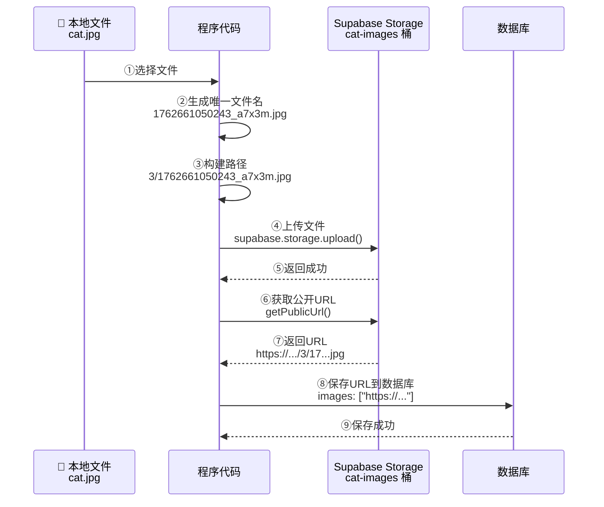
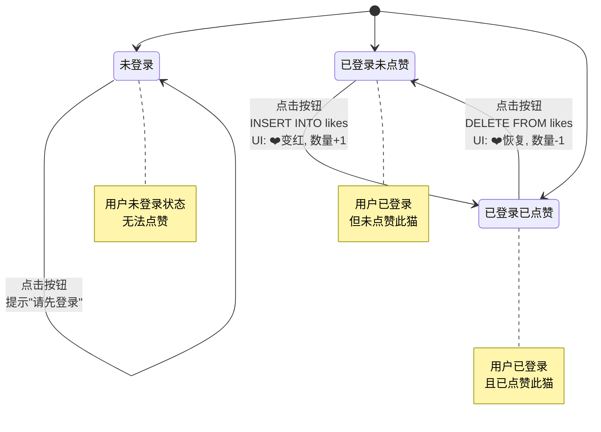
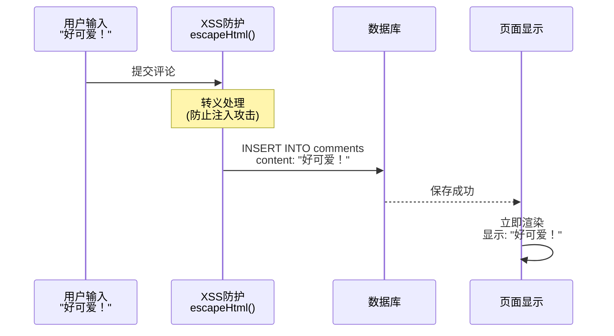

##### 3.9.6 核心功能代码解读

现在让我们仔细看几个关键函数，理解它们的工作原理。

**功能1：上传图片到云存储**

```javascript
async function uploadImageToStorage(file, catId) {
    // 1. 生成唯一文件名
    const timestamp = Date.now();           // 当前时间戳: 1762661050243
    const fileExt = file.name.split('.').pop();  // 文件扩展名: "jpg"
    const randomStr = Math.random().toString(36).substring(7);  // 随机字符串: "a7x3m"
    const fileName = `${timestamp}_${randomStr}.${fileExt}`;    // 1762661050243_a7x3m.jpg

    // 2. 构建完整路径: {catId}/{fileName}
    const filePath = `${catId}/${fileName}`;  // 例如: "3/1762661050243_a7x3m.jpg"

    // 3. 上传文件到 Supabase Storage
    const { data, error } = await supabase.storage
        .from('cat-images')      // 从 cat-images 桶
        .upload(filePath, file, {
            cacheControl: '3600',     // 缓存1小时
            upsert: false             // 不覆盖同名文件
        });

    if (error) {
        throw error;  // 上传失败，抛出错误
    }

    // 4. 获取公开访问 URL
    const { data: urlData } = supabase.storage
        .from('cat-images')
        .getPublicUrl(filePath);

    return urlData.publicUrl;  // 返回: "https://xxx.supabase.co/storage/.../3/1762661050243_a7x3m.jpg"
}
```

文件上传流程图：


**功能2：点赞功能的实现**

```javascript
async function setupLikeButton(card, catId) {
    const likeBtn = card.querySelector('.like-btn');
    const likeCount = card.querySelector('.like-count');

    // 1. 检查当前用户是否已点赞
    let userLiked = false;
    if (currentUser) {
        const { data } = await supabase
            .from('likes')
            .select('*')
            .eq('cat_id', catId)
            .eq('user_id', currentUser.id)
            .single();

        userLiked = !!data;  // 转换为布尔值
        if (userLiked) {
            likeBtn.classList.add('liked');  // 添加红色样式
        }
    }

    // 2. 绑定点击事件
    likeBtn.addEventListener('click', async () => {
        if (!currentUser) {
            alert('请先登录');
            return;
        }

        if (userLiked) {
            // 取消点赞
            await supabase
                .from('likes')
                .delete()
                .eq('cat_id', catId)
                .eq('user_id', currentUser.id);

            likeBtn.classList.remove('liked');
            likeCount.textContent = parseInt(likeCount.textContent) - 1;
            userLiked = false;
        } else {
            // 添加点赞
            await supabase
                .from('likes')
                .insert({
                    cat_id: catId,
                    user_id: currentUser.id
                });

            likeBtn.classList.add('liked');
            likeCount.textContent = parseInt(likeCount.textContent) + 1;
            userLiked = true;
        }
    });
}
```

点赞状态机：


**功能3：评论功能的实现**

```javascript
async function setupCommentForm(card, catId) {
    const form = card.querySelector('.comment-form');
    const input = card.querySelector('.comment-input');
    const commentsList = card.querySelector('.comments-list');

    form.addEventListener('submit', async (e) => {
        e.preventDefault();  // 阻止表单默认提交行为

        const content = input.value.trim();
        if (!content) return;  // 空评论不提交

        if (!currentUser) {
            alert('请先登录');
            return;
        }

        // 1. 转义 HTML 防止 XSS 攻击
        const safeContent = escapeHtml(content);

        // 2. 插入评论到数据库
        const { data, error } = await supabase
            .from('comments')
            .insert({
                cat_id: catId,
                user_id: currentUser.id,
                content: safeContent
            })
            .select()
            .single();

        if (error) {
            alert('评论失败');
            return;
        }

        // 3. 立即在页面上显示新评论（乐观更新）
        const newComment = document.createElement('div');
        newComment.className = 'comment-item';
        newComment.innerHTML = `
            <div class="comment-author">${currentUser.email}</div>
            <div class="comment-content">${safeContent}</div>
            <div class="comment-time">刚刚</div>
        `;
        commentsList.prepend(newComment);  // 添加到顶部

        // 4. 清空输入框
        input.value = '';
    });
}

// XSS 防护函数
function escapeHtml(text) {
    const div = document.createElement('div');
    div.textContent = text;  // textContent 会自动转义
    return div.innerHTML;
}
```

评论提交流程：

**正常评论：**


**恶意输入防护：**
```mermaid
sequenceDiagram
    participant User as 恶意输入<br/>"&lt;script&gt;alert&lt;/script&gt;"
    participant XSS as XSS防护<br/>escapeHtml()
    participant DB as 数据库
    participant UI as 页面显示

    User->>XSS: 提交评论
    Note over XSS: 转义为:<br/>"&amp;lt;script&amp;gt;..."
    XSS->>DB: 保存转义后内容
    DB-->>UI: 保存成功
    UI->>UI: 显示纯文本<br/>"&lt;script&gt;alert&lt;/script&gt;"<br/>(不会执行代码)

    Note over User,UI: XSS 攻击被成功阻止
```